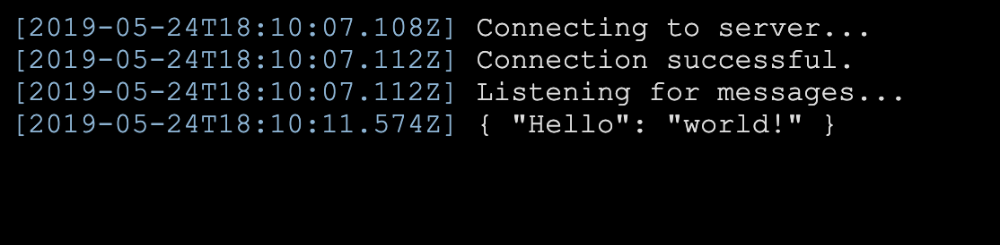

# FishBowl

FishBowl is a real-time application monitoring system. It uses websockets and a redis subscription to display requests as they happen.

## Getting Started

Run [`bin/setup`](bin/setup) from the root of the repository. Then, make a copy of `.env.sample` in `.env` and change the local variables as necessary. Ensure you have a redis instance running at the specified address. Then, you can then run `bin/start` to start the local server, running at `localhost:4567`.

You can now open up `localhost:4567` in a browser and authenticate using the credentials you provided in `.env`. The last message you see should say "Listening for messages...". Now you can post events and see them as they come in. For example, you can test it out with `curl`:

```bash
curl -X POST \
  -H "Content-Type: application/json" \
  -d '{ "Hello": "world!" }' \
  localhost:4567/events
```

You should see that event pop up in your browser. Any POST payload will be read and displayed along with the timestamp that it is received. The browser should now look something like the below screenshot:



## Caveats

This could potentially seriously overwhelm a redis instance if the volume is very high. It's meant for prototyping and relatively low-volume throughput. Additionally, if you're attempting to throw a bunch of information at it you could slow down the source application if you're not smart about request queuing/batching. Finally, this application does not store anything in redis (or any other data store for that matter) so you have to have the application running in your browser or you will miss the events.

## Contributing

Bug reports and pull requests are welcome on GitHub at https://github.com/CultureHQ/fishbowl.

## License

The code is available as open source under the terms of the [MIT License](https://opensource.org/licenses/MIT).
